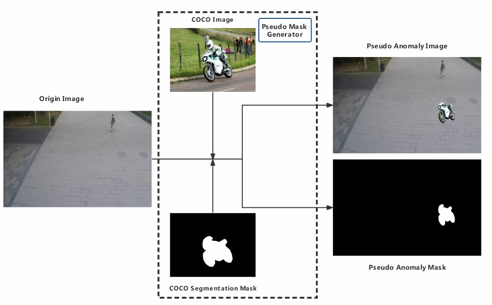
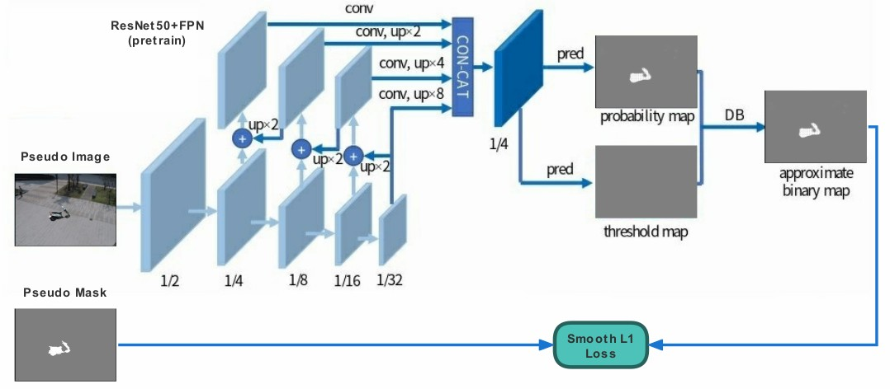
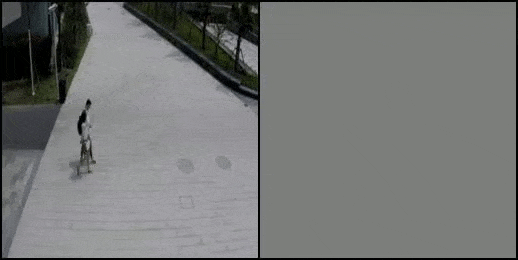
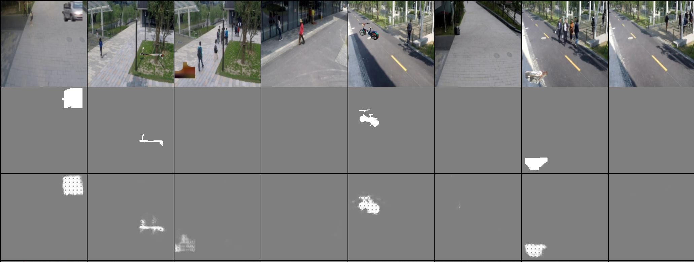
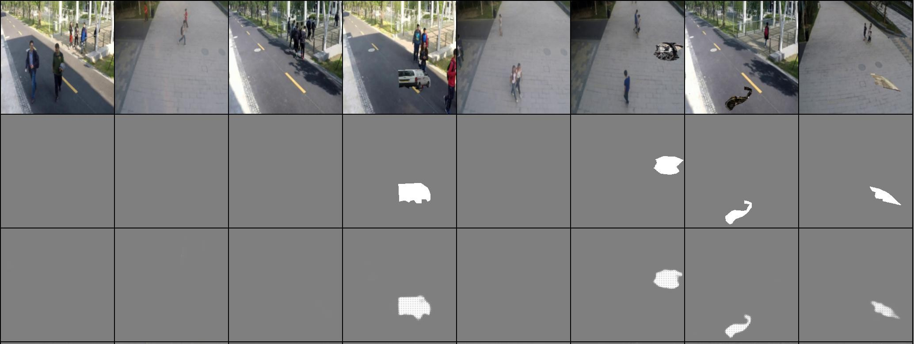

# Self-Supervised Anomaly Segmentation

## Intorduction

This is a PyToch implementation of [A Novel Self-supervised Learning Task Designed for Anomaly Segmentation](), it contains two mainly parts, Pseudo Mask Generator and Anomaly Segmentation Framework, as shown in next:

**Pseudo Mask Generator:**

    

**Anomaly Segmentation Framework(ResNet50+FPN+DBNet):**

  

## Contributions

- [x] we propose a novel self-supervised learning pretext task, which is different from generation-based methods or commonly contrastive leanring, it generat pseudo mask from other labeled dataset such as CoCo, and every suitable for pixelwise downstream tasks.
- [x] we present an end-to-end anomaly segmenation framework, it has both high speed and accuracy, and with no post-processing.
- [ ] our method achieve SOTA in three anomaly detection/segmentation datasets. (#ToDo)

## Anomaly Segmentation Demo(SHTech dataset)



## Dataset Download

* USCD Ped2 [[dataset](https://github.com/StevenLiuWen/ano_pred_cvpr2018)]
* CUHK Avenue [[dataset](https://github.com/StevenLiuWen/ano_pred_cvpr2018)]
* ShanghaiTech [[dataset](https://github.com/StevenLiuWen/ano_pred_cvpr2018)]
* COCO [[dataset](http://mscoco.org/)]

## Installation and Usage

1. prepare environment:

   ```
   conda create -n ssas python=3.7.6
   conda activate ssas
   pip install -r requirements.txt
   git clone https://github.com/wufan-tb/ssas
   ```

2. prepare coco pseudo mask:

   ```
   cd dataset
   python select_coco_annotation.py --image_dir {coco img folder} --annotation_path {coco_annotation.json}
   cd ..
   ```

3. training vad dataset(such as Ped2, SHTech):

   ```
   python train.py --dataset_path {your dataset path}
   ```

4. evaluation:

   ```
   python eval.py --dataset_path {your dataset path}
   ```

5. testing(generating segmentation demo):

   ```
   python inference.py --input {test imgs or video or camera} --output {save dir} --weights {xxx.pt}
   ```

## Training Sample





## Citation

If you find our work useful, please cite as follow:

```
{   ssas,
    author = {Wu Fan},
    title = { Self-Supervised Anomaly Segmentation },
    year = {2021},
    url = {\url{https://github.com/wufan-tb/ssas}}
}
```
